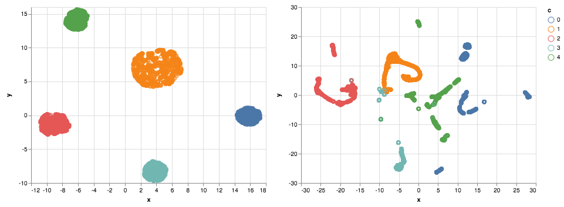

# Welcome to Sim S(ingle)-C(ellular)ity

The intention of this repo is to factor out code used to simulate scRNA data. Rather than writing it many times for many uses, we can write it one time and incorporate many features into our simulator. 

Refer [this preprint](https://www.biorxiv.org/content/10.1101/786269v1) for more information. 

Examples of data that we might want to generate:

 - A particular type of latent space, to test if we can learn it
 - A given batch structure, to test if we can correct for it
 - Gene counts sampled according to a given model, to test if the underlying model can be recovered
 - Data associated with a phenotype, to see if our models can learn that relationship (using the same generative model or otherwise)

Example usage:

```python
from simscity import *

import altair as alt
import pandas as pd
import numpy as np
import umap
```


```python
n_classes = 5
n_latent = 6
n_cells = 5000
n_features = 1000
n_conditions = 8

scale = 5
sparsity = 0.8
```


```python
programs = latent.gen_programs(n_latent, n_features, sparsity, scale)

classes = latent.gen_classes(n_latent, n_classes, sparsity, scale)

latent_exp, class_labels = latent.sample_classes(n_cells, classes, cells_per_class=1000)

expression = np.dot(latent_exp, programs)

u = umap.UMAP().fit_transform(expression)
```

    UMAP raises a ton of warnings for me but it seems to be working fine.


```python
umis = sequencing.umi_counts(np.exp(expression), lib_size=10000)

u2 = umap.UMAP().fit_transform(umis)
```

    More warnings...


```python
alt.hconcat(
    alt.Chart(
        data=pd.DataFrame({'x': u[:,0], 'y': u[:,1], 'c': class_labels})
    ).mark_point().encode(x='x:Q', y='y:Q', color='c:N'),
    alt.Chart(
        data=pd.DataFrame({'x': u2[:,0], 'y': u2[:,1], 'c': class_labels})
    ).mark_point().encode(x='x:Q', y='y:Q', color='c:N')
)
```


